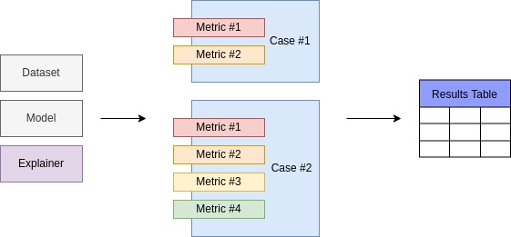

# xai-benchmark

Open and extensible benchmark for XAI methods

## Description

XAIB is an open benchmark that provides a way to compare different XAI methods using broad set of metrics that measure different aspects of interpretability

## Installation

```bash
pip3 install xai-benchmark
```

Remember to create virtual environment if you need one.  

After the installation you can verify the package by printing out its version:

```python
import xaib
print(xaib.__version__)
```

To use all explainers you should also install `explainers_requirements.txt` which can be done
directly

```bash
pip3 install -r https://raw.githubusercontent.com/oxid15/xai-benchmark/master/explainers_requirements.txt
```

## Results

Updated results table can be found [hosted here](https://oxid15.github.io/xai-benchmark/results)  

## How to use

### Introduction

XAIB is build to bring various data, models and explainers together and
measure quality of an explainer in different ways.  
  
The setup is formed from particular Dataset, Model and Explainer.  
Case stands for some interpretability quality which we are trying to proxy numerically
using Metrics. Since there are always more than one way to measure something, one Case
may (and should ideally) have several metrics inside.

Read more on [Cases](https://oxid15.github.io/xai-benchmark/cases) and [Metrics](https://oxid15.github.io/xai-benchmark/metrics) in documentation.



### Reproduce

Full run will be available soon.  
Until then, there are regular [pipelines](https://github.com/Oxid15/xai-benchmark/actions)  
  
For the implementation of the evaluation procedure, you can visit `xaib/evaluation`

### Try method

All explanation methods in XAIB have the same input and output interface which allows to
use them easily and compare.  
If you want to run an Explainer and see the results you can do this:

```python
from xaib.explainers.feature_importance.lime_explainer import LimeExplainer
from xaib.evaluation import DatasetFactory, ModelFactory

# Get the dataset and train the model
train_ds, test_ds = DatasetFactory().get('synthetic')
model = ModelFactory(train_ds, test_ds).get('svm')
```

```python
# You can also get the default one using ExplainerFactory
explainer = LimeExplainer(train_ds, labels=[0, 1])
```

```python
# Obtain batch from dataset
sample = [test_ds[i]['item'] for i in range(10)]
```

```python
# Obtain explanations
explanations = explainer.predict(sample, model)

print(explanations)
```

### Evaluate method

To evaluate some existing method on all
cases you should create a default setup and run it

```python
from xaib.evaluation import DatasetFactory, ModelFactory
from xaib.evaluation.example_selection import ExplainerFactory, ExperimentFactory
from xaib.evaluation.utils import visualize_results


train_ds, test_ds = DatasetFactory().get('synthetic')
model = ModelFactory(train_ds, test_ds).get('knn')

explainer = ExplainerFactory(train_ds, model).get('knn')
```

```python
# Run all experiments on chosen method
experiment_factory = ExperimentFactory(
    repo_path='results',
    explainers={'knn': explainer},
    test_ds=test_ds,
    model=model,
    batch_size=10
)

experiments = experiment_factory.get('all')
for name in experiments:
    experiments[name]()

# Save plot to the results folder
visualize_results('results', 'results/results.png')
```

## How to contribute

Any contributions are welcome! You can help to extend
the picture of XAI-methods quality by adding:

- [New Dataset](#add-dataset)
- [New Model](#add-model)
- [New Explainer](#add-explainer)
- [New Metric](#add-metric)
- [New Case (?)](https://github.com/Oxid15/xai-benchmark/issues) - please, fill the issue first to discuss

### Add dataset

New datasets may extend our understanding of how different explainers
behave in context of different domains and tasks.  
To add your dataset, you should provide a Wrapper, which will
download or access prepared data from disk.

#### Create data wrapper

First you need to create a wrapper with required interface and fields

```python
import numpy as np
from xaib import Dataset


class NewDataset(Dataset):
    """
    Here the documentation on data should be filled
    """
    def __init__(self, split, *args, **kwargs) -> None:
        super().__init__(*args, **kwargs)

        # It is important to set the name
        # the name will be used to identify a dataset
        self.name = 'new_dataset'

        # While creating you can download and cache data,
        # define splits, etc
        if split == 'train':
            self._data = [(0, 1, 2), (3, 4, 5), (6, 7, 8)]
            self._labels = [0, 1, 0]
        elif split == 'test':
            self._data = [(9, 10, 11), (12, 13, 14)]
            self._labels = [1, 0]

    def __getitem__(self, index):
        # This form of returning items is required - Dict[str, np.ndarray[Any]]
        return {
            'item': np.asarray(self._data[index]),
            'label': np.asarray(self._labels[index])
        }

    def __len__(self):
        return len(self._data)
```

#### Test new dataset

Before adding your implementation directly into source code, it would be useful to
test how it will work with standard XAIB setup

```python

from xaib.evaluation import DatasetFactory, ModelFactory
from xaib.evaluation.feature_importance import ExplainerFactory, ExperimentFactory
from xaib.evaluation.utils import visualize_results


# Here you create your data
train_ds, test_ds = NewDataset('train'), NewDataset('test')

# And then pass it further
model = ModelFactory(train_ds, test_ds).get('svm')

explainers = ExplainerFactory(train_ds, model, labels=[0, 1]).get('all')

experiment_factory = ExperimentFactory(
    repo_path='results',
    explainers=explainers,
    test_ds=test_ds,
    model=model,
    batch_size=10
)

experiments = experiment_factory.get('all')
for name in experiments:
    experiments[name]()


visualize_results('results', 'results/results.png')
```

#### Integrate new dataset

Finally you can integrate your dataset into the source code.  
To do that you need to add it into `xaib.datasets` module
and then make a constructor for the Factory.

```python
# xaib/evaluation/dataset_factory.py
# ...
from ..datasets.new_dataset import NewDataset
# ...

# Create a constructor - function that will build your dataset
# it should provide all defaults needed
def new_dataset():
    return NewDataset('train'), NewDataset('test')


class DatasetFactory(Factory):
    def __init__(self) -> None:
        # ...
        # add it to the factory
        self._constructors['new_dataset'] = lambda: new_dataset()
```

### Add model

New models and model classes provide information on how good explainers
are in some particular cases.

#### Create model wrapper

First model wrapper should be implemented. It has many
required methods that should be implemented.
For example `fit` and `evaluate` methods are needed
to be able to train the model on different datasets
see specification in `xaib/base` and examples in
`xaib/evaluation/model_factory.py`

```python
import numpy as np
from xaib import Model


class NewModel(Model):
    """
    Here the documentation on model should be filled
    """
    def __init__(self, const, *args, **kwargs):
        super().__init__(*args, **kwargs)

        self.const = const

        # It is important to set the name
        # the name will be used to identify a model
        self.name = 'new_model'

    def fit(self, x, y):
        pass

    def evaluate(self, x, y):
        pass

    def predict(self, x):
        return np.array([self.const for _ in range(len(x))])

    def save(self, filepath, *args, **kwargs):
        with open(filepath, 'w') as f:
            f.write(str(self.const))

    def load(self, filepath, *args, **kwargs):
        with open(filepath, 'r') as f:
            self.const = float(f.read())
        # load does not return anything - just fills
        # internal state

```

#### Test new model

Before adding your implementation directly into source code, it would be useful to
test how it will work with standard XAIB setup

```python
from xaib.evaluation import DatasetFactory
from xaib.evaluation.feature_importance import ExplainerFactory, ExperimentFactory
from xaib.evaluation.utils import visualize_results


# Create your model
model = NewModel(const=1)
```

```python
train_ds, test_ds = DatasetFactory().get('synthetic')
explainers = {'shap': ExplainerFactory(train_ds, model, labels=[0, 1]).get('shap')}

experiment_factory = ExperimentFactory(
    repo_path='results',
    explainers=explainers,
    test_ds=test_ds,
    model=model, # and put it here
    batch_size=10
)

experiments = experiment_factory.get('all')
for name in experiments:
    experiments[name]()


visualize_results('results', 'results/results.png')
```

#### Integrate new model

Finally you can integrate your model into the source code.  
To do that you need to add it into `xaib.models` module
and then make a constructor for the Factory.

```python
# xaib/evaluation/model_factory.py
# ...
from ..models.new_model import NewModel
# ...

# Create a constructor - function that will build your model
def new_model(const):
    return NewModel(const=const)


class ModelFactory(Factory):
    def __init__(self) -> None:
        
        # ...
        # add it to the factory
        self._constructors['new_model'] = lambda: new_model(const=1)
```

### Add explainer

Explainers are the heart of this benchmark, they are being thorougly tested
and the more of them added, the more we know

#### Create wrapper

Explainers wrappers are less demanding than model's which makes them
easier to be implemented

```python
import numpy as np
from xaib import Explainer


class NewExplainer(Explainer):
    def __init__(self, *args, **kwargs):
        super().__init__(*args, **kwargs)

        # name is essential to put explainer into
        # results table correctly
        self.name = 'new_explainer'

    def predict(self, x, model, *args, **kwargs):
        return np.random.rand(len(x), len(x[0]))
```

#### Test new explainer

Before adding your implementation directly into source code, it would be useful to
test how it will work with standard XAIB setup

```python
from xaib.evaluation import DatasetFactory, ModelFactory
from xaib.evaluation.feature_importance import ExperimentFactory
from xaib.evaluation.utils import visualize_results


train_ds, test_ds = DatasetFactory().get('synthetic')
model = ModelFactory(train_ds, test_ds).get('svm')
```

```python
explainers = {'new_explainer': NewExplainer()}

experiment_factory = ExperimentFactory(
    repo_path='results',
    explainers=explainers,
    test_ds=test_ds,
    model=model,
    batch_size=10
)

experiments = experiment_factory.get('all')
for name in experiments:
    experiments[name]()

visualize_results('results', 'results/results.png')
```

#### Integrate new explainer

Finally you can integrate your explainer into the source code.  
To do that you need to add it into `xaib.explainers` module
and then make a constructor for the Factory.

```python
# xaib/evaluation/feature_importance/explainer_factory.py
# ...
from ...explainers.feature_importance.new_explainer import NewExplainer
# ...

# Create a constructor - function that will build your explainer
def new_explainer():
    return NewExplainer()


class ExplainerFactory(Factory):
    def __init__(self) -> None:
        
        # ...
        # add it to the factory
        self._constructors['new_explainer'] = lambda: new_explainer()
```

### Add metric

Metrics are ways to numerically assess the quality of explainers and are parts of
Cases

#### Create metric

First you need to create a Metric object - which will accept and explainer and data
and return some value

```python
    from xaib import Metric

    class NewMetric(Metric):
        def __init__(self, ds, model *args, **kwargs):
            super().__init__(ds, model, *args, **kwargs)

            self.name = 'new_metric'
            self.direction = 'down'

        def compute(self, explainer, *args, batch_size=1, expl_kwargs=None, **kwargs):
            if expl_kwargs is None:
                expl_kwargs = {}

            dl = SimpleDataloader(self._ds, batch_size=batch_size)
            for batch in tqdm(dl):
                # get explanations
                ex = expl.predict(batch['item'], self._model, **expl_kwargs)

            # Here compute and return your metric

            return np.random.rand()
```

#### Test new metric

Before adding your implementation directly into source code, it would be useful to
test how it will work with standard XAIB setup  
  
Since metrics are more low-level objects, they need special treatment
when tested. Basically you need to create metric and append it to the existing
Case of choice.

```python
from xaib.evaluation import DatasetFactory, ModelFactory
from xaib.evaluation.feature_importance import ExplainerFactory
from xaib.evaluation.utils import visualize_results, experiment


train_ds, test_ds = DatasetFactory().get('synthetic')
model = ModelFactory(train_ds, test_ds).get('svm')

explainers = ExplainerFactory(train_ds, model, labels=[0, 1]).get('all')

metric = NewMetric(test_ds, model)


@experiment(
    'results',
    explainers=explainers,
    metrics_kwargs={
        'other_disagreement': dict(expls=list(explainers.values()))
    }
)
def coherence():
    case = CoherenceCase(test_ds, model)
    case.add_metric('new_metric', metric)
    return case

coherence()

visualize_results('results', 'results/results.png')
```

#### Integrate new metric

```python
# xaib/cases/feature_importance/coherence_case.py
# ...
from ...metrics.feature_importance import NewMetric


class CoherenceCase(Case):
    def __init__(self, ds: Dataset, model: Model, *args: Any, **kwargs: Any) -> None:
        super().__init__(ds, model, *args, **kwargs)
        # ...

        self._metric_objs['new_metric'] = NewMetric(ds, model)

```

## License

[MIT](https://choosealicense.com/licenses/mit/)

## Versions

This project follows Semantic Versioning - [semver.org](https://semver.org/)
